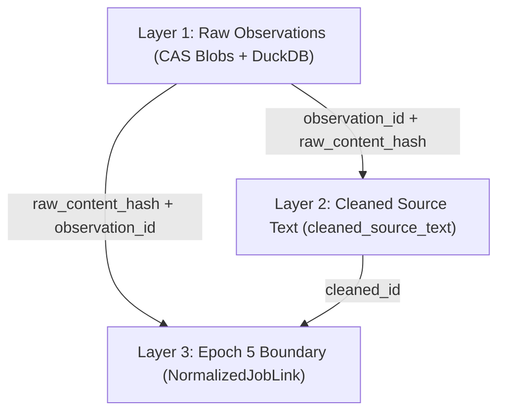

# Radar-Vagas Architecture Document (Época 4 Completed)

## 1. Overview

**Radar-Vagas** is a local-first job market intelligence platform. Épocas 1–3 built the connector framework, multi-source ingestion service, and local run storage. **Época 4 (Raw Data and Historical Storage)** provides a fully hardened, observable, and reproducible storage layer backed by DuckDB metadata, Content-Addressed Storage (CAS) SHA-256 payload blobs, versioned HTML/text cleaning, atomic snapshot backup/restore, retention pruning, and migration tampering protection.

---

## 2. Directory Layout & Layer Separation

```text
Radar-Vagas/
├── pyproject.toml              # Dependencies, build configs, CLI script entrypoint
├── Makefile                    # Developer shortcut commands
├── README.md                   # System documentation and setup guide
├── .env.example                # Environment configuration template
├── .github/workflows/ci.yml    # GitHub Actions CI workflow
├── catalogs/                   # TOML source catalog files with governance metadata
│   ├── aggregators.toml        # Remotive, Arbeitnow
│   ├── greenhouse.toml         # Greenhouse ATS boards
│   └── lever.toml              # Lever ATS companies
├── docs/                       # Project specifications & architecture reports
│   ├── AGENTS.md
│   ├── Epochs.md
│   ├── POC.md
│   ├── ARCHITECTURE.md
│   └── EPOCH4_REPORT.md
├── src/
│   └── radar_vagas/
│       ├── __init__.py         # Package version export
│       ├── cli.py              # CLI entry point (info, doctor, sources, collect, runs, history)
│       ├── core/               # Configuration, logging, ingestion, and services
│       │   ├── cleaner.py      # TextCleaner service for deterministic HTML tag stripping
│       │   ├── history_service.py # High-level historical service & backup/restore orchestration
│       │   ├── ingestion.py    # ConnectorRunner with scheduling quantum
│       │   ├── config.py       # Typed Settings (pydantic-settings)
│       │   └── logging.py      # Standardized logging formatter
│       ├── domain/             # Core Entities, Schemas & Protocols
│       │   ├── models.py       # RawJobRecord, CleanedSourceText, BackupManifest, RetentionPolicy, etc.
│       │   └── connector.py    # JobConnector Protocol
│       ├── connectors/         # Production connector implementations
│       │   ├── remotive.py     # Remotive aggregator API connector
│       │   ├── arbeitnow.py    # Arbeitnow aggregator API connector
│       │   ├── greenhouse.py   # Greenhouse ATS Board API connector
│       │   └── lever.py        # Lever ATS Postings API connector
│       ├── sources/            # Source catalog and connector registry
│       │   ├── catalog.py      # TOML catalog loader and filter utilities
│       │   └── registry.py     # SourceType → ConnectorFactory registry
│       └── infrastructure/     # External Clients & Infrastructure Interfaces
│           ├── history.py      # DuckDB storage, CAS SHA-256 blobs, migrations, backup & prune
│           ├── http.py         # HttpPolicy, polite_get, retry/backoff
│           └── llm/
│               └── ollama_client.py # Ollama service diagnostics
├── poc/                        # Isolated experimental PoC scripts
└── tests/                      # 100% offline test suite (119 passing tests)
```

---

## 3. Core Architectural Decisions

### 3.1 Local-First & Zero-Cost Dependency
- The application runs entirely on the developer's local machine (Linux).
- All unit tests and core pipeline routines pass 100% offline without requiring internet access or active LLM daemons.

### 3.2 Raw Payload Preservation & Content-Addressed Storage (CAS)
- Ingestion connectors save 100% of raw JSON payloads.
- Raw payloads are stored under a two-tier SHA-256 directory layout: `blobs/sha256/xx/yy/<hash>.json`.
- Payload writes use atomic temporary files, `fsync`, and hard links to ensure immutability and crash resilience.

### 3.3 Data Layer Provenance & Ownership



1. **Layer 1 (Raw Payload & Observations)**: Owned by `HistoricalStorage` (`source_job_observations`, `raw_blobs`, `ingestion_runs`). Immutable.
2. **Layer 2 (Derived Cleaned Text)**: Owned by `TextCleaner` (`cleaned_source_text`). Deterministic HTML tag stripping and entity decoding, versioned by `transformation_name` and `transformation_version`.
3. **Layer 3 (Normalized Boundary Contract)**: Defined by `NormalizedJobLink` in `domain.models`. Links normalized job entities in Epoch 5 back to their raw observation and cleaned text IDs.

---

## 4. Historical Storage & Governance Engine (Época 4)

### 4.1 DuckDB Schema & Sequential Migrations

`HistoricalStorage` manages DuckDB migrations 0 through 11:
- `schema_migrations`: Version tracking and SHA-256 checksum validation to detect migration tampering (`MigrationTamperedError`).
- `ingestion_runs`: Global run metrics, timestamps, limits, and application version.
- `source_runs`: Per-source execution metrics and state (`success`, `partial`, `failed`).
- `raw_blobs`: Primary key registry of SHA-256 hashes and payload byte sizes.
- `source_jobs`: Lifecycle metadata (`first_seen_at`, `last_seen_at`, `missing_complete_runs`, `status`).
- `source_job_observations`: Granular observation instances (`observation_id`, `run_id`, `content_hash`, `observed_at`, `changed_since_previous`).
- `cleaned_source_text`: Versioned cleaned text linked to `observation_id`.
- `historical_quarantine`: Structured quarantine logging malformed payload envelopes with failure phase and error messages.

### 4.2 Backup and Restore Snapshot Strategy

`history backup` creates an atomic, consistent snapshot containing:
1. `history.duckdb` (checkpointed and copied)
2. `blobs/sha256/...` (copied directory tree)
3. `backup_manifest.json` containing backup ID, creation timestamp, schema version, total blob count, total byte size, and database SHA-256 checksum.

`history restore` safety rules:
- Fails with `FileExistsError` if the target directory is non-empty, unless `--force` is specified.
- Automatically verifies database SHA-256 checksum against `backup_manifest.json`.
- Runs full `verify_integrity()` after restoring to validate filesystem/database parity.

### 4.3 Retention & Deletion Safety

`history prune` rules:
- **Preview Mode (Default)**: Dry-run preview calculates eligible runs, observations, orphan blobs, and freed bytes without mutating disk state (`preview_only=True`).
- **Destructive Mode (`--force`)**: Deletes old runs and observations while strictly respecting `keep_minimum_runs=5`.
- **Ref-Count Protection**: Raw payload blobs referenced by any remaining observation are preserved; only unreferenced orphan blobs are removed.

### 4.4 Migration Hardening & Recovery Procedures

Every committed migration in `MIGRATIONS` has a computed SHA-256 checksum. When initializing `HistoricalStorage`:
- If an applied migration in `schema_migrations` has a checksum mismatch with code, a `MigrationTamperedError` is raised immediately.
- **Recovery Procedure**: If a migration script was accidentally edited after deployment, revert the code change to match the committed migration SQL, or run database recovery by restoring a valid backup snapshot via `radar-vagas history restore`.

---

## 5. Quality & Validation Metrics

- **Test Suite**: 119 passing tests running 100% offline.
- **Linter & Formatter**: `ruff check .` and `ruff format .` clean.
- **Git Diff**: `git diff --check` clean.
- **Performance Budget**: Scale benchmarks verified up to 3,000 synthetic records completing under 5 seconds.
