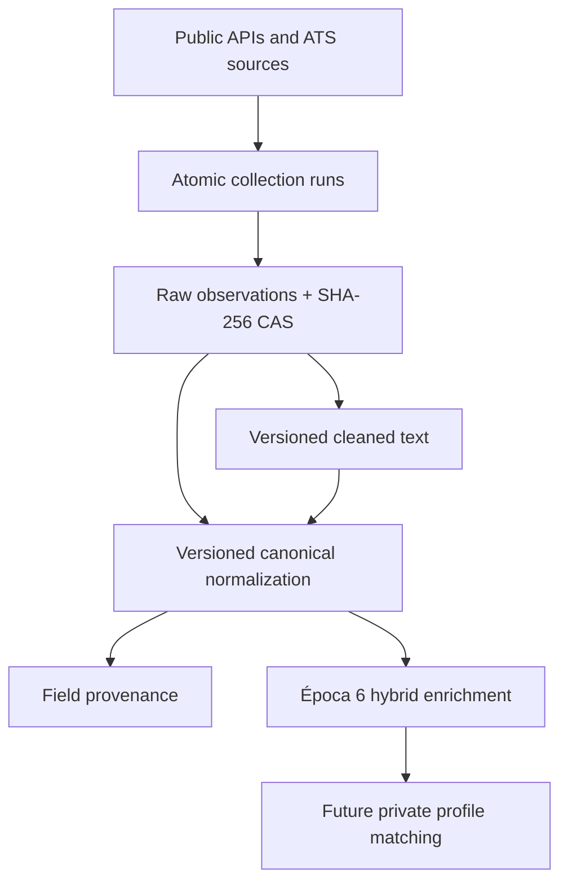

# Radar-Vagas Architecture (Época 5)

## 1. Overview

Radar-Vagas is a local-first job and career intelligence engine designed to evolve into an
accessible hosted web product. Épocas 1–4 established source connectors, atomic run storage,
DuckDB history, SHA-256 Content-Addressed Storage (CAS), replay, cleaning, retention,
quarantine, and verified backup/restore. Época 5 adds deterministic canonical normalization,
versioned taxonomies, field provenance, and inter-process coordination.

The local architecture is the current development and personal-use environment. Domain
contracts deliberately avoid coupling the product to DuckDB, Ollama, or one future web stack.

## 2. Data Flow and Ownership



- **Raw observations** are immutable source evidence.
- **Cleaned text** is reproducible derived data identified by transformation and version.
- **Normalized records** represent one observation processed by one normalization rule
  version.
- **Field provenance** records original and normalized values, rule identity, version, and
  confidence category.
- **Future enrichment** must remain replaceable and must never become required for accessing
  normalized jobs.
- **Future profile and workflow data** belongs to a user-private boundary, separate from the
  shared job corpus.

## 3. Historical Storage

### 3.1 DuckDB and CAS

DuckDB stores ingestion runs, source lifecycle state, observations, cleaned artifacts,
quarantine records, normalized versions, and provenance. Raw payloads live under
`blobs/sha256/xx/yy/<content_hash>.json`. Reads verify that file contents still match their
address.

Migrations are append-only and carry SHA-256 checksums. Opening a database rejects an unknown
future schema or an applied migration whose checked-in SQL has changed.

### 3.2 Inter-Process Lock

`HistoryLock` uses Linux `fcntl.flock` on a stable sibling file:

```text
<data_dir parent>/.<data_dir name>.history.lock
```

The sibling location remains stable when restore atomically replaces the target data
directory. Schema migrations and every public mutation acquire this lock. A
`HistoricalStorage` context holds it across multi-step service operations; individual mutation
methods also acquire it for callers that do not use a context. Same-thread nested operations
are re-entrant.

Backup holds the same lock across checkpoint, database copy, CAS copy, manifest creation, and
snapshot publication. Restore acquires the target lock before inspecting or replacing the
target. Lock contention has a bounded timeout and becomes an actionable CLI error.

### 3.3 Backup, Restore, and Retention

- Backup is assembled in a sibling staging directory and published by rename only when
  complete.
- Existing backup destinations are rejected rather than merged.
- Restore verifies the manifest database checksum and full staged CAS integrity before target
  replacement.
- Forced restore keeps the prior target until the staged replacement is ready.
- Retention is preview-only unless `--force` is supplied.
- DuckDB foreign-key limitations require idempotent deletion phases ordered from normalized
  provenance through observations to ingestion runs.
- CAS files are removed only after their database metadata is unreferenced and committed.

## 4. Canonical Normalization

### 4.1 Schema

`CanonicalJobPost` includes source identity, observation and raw hashes, company, title,
location components, ISO country code, work arrangement, employment type, publication date,
description, application URL, role family, seniority, language, rule version, and timestamp.
Missing or ambiguous values use `None`; placeholders such as `"unknown"` are not persisted.

Controlled role families cover the product scope, including Data Platform Engineering,
Business Intelligence Engineering, and Technical Data Analysis. Seniority distinguishes Staff
from Principal.

### 4.2 Source Adapters and Taxonomies

Greenhouse, Lever, Remotive, and Arbeitnow have deterministic adapters. Source-specific
identity rules preserve the exact `source_job_id` used by ingestion, including ATS board or
company prefixes.

Versioned TOML taxonomies control role family, seniority, work arrangement, employment type,
and country mappings. Short aliases use token boundaries so values such as `de`, `us`, or `pl`
cannot accidentally match arbitrary words.

### 4.3 Identity, Versioning, and Provenance

- `normalized_job_id` is a deterministic digest of source, source job ID, observation ID, and
  normalization rule version.
- `(observation_id, normalization_rule_version)` is unique and idempotent.
- Changed source observations receive distinct normalized IDs.
- Reprocessing with a new rule version preserves prior normalized history.
- At most one latest cleaned artifact is selected per observation.
- Storage verifies source identity, raw hash, cleaned-artifact ownership, and field-provenance
  ownership before writing.
- Invalid payloads or adapter failures are quarantined with `failure_phase="normalize"`.

## 5. Future Product Direction

Época 6 introduces evidence-based hybrid enrichment:

```text
deterministic extraction
    -> ambiguity assessment
    -> optional replaceable inference provider
    -> schema validation and evidence
    -> versioned shared cache
```

The no-LLM path remains functional. Ollama is an optional local evaluation adapter, not a
requirement for future users. A hosted deployment can expose the engine through an API and web
interface, process shared job facts once, and keep candidate profiles and application workflow
private per user. See [PRODUCT_DIRECTION.md](PRODUCT_DIRECTION.md).

## 6. Quality Standards

- All automated tests run offline.
- Source fixtures and a manually reviewed golden dataset protect deterministic behavior.
- End-to-end tests cover import, cleaning, normalization, versioning, backup, restore, and
  normalized queries.
- Ruff formatting, Ruff linting, and `git diff --check` are required before commit.
- Test counts and performance timings belong in dated validation reports rather than permanent
  architecture claims.
