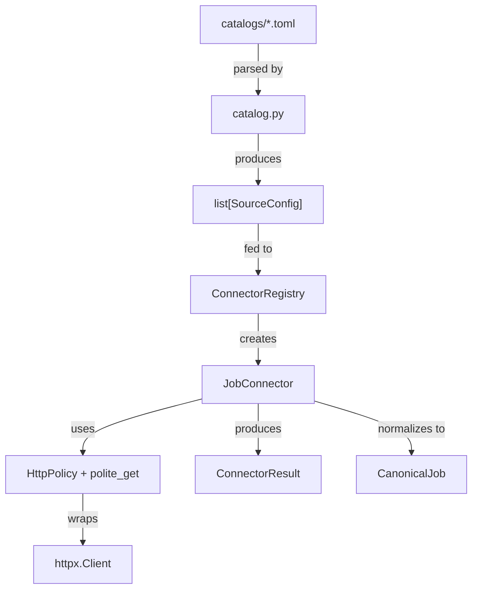

# Radar-Vagas Architecture Document (Época 2 - Source Catalog & Connector Framework)

## 1. Overview

**Radar-Vagas** is a local-first job market intelligence platform. Época 1 established a clean, maintainable foundation. Época 2 adds a catalogue-driven, contract-based connector framework that allows new job data sources to be registered and executed without modifying the ingestion pipeline.

## 2. Directory Layout & Layer Separation

```text
Radar-Vagas/
├── pyproject.toml              # Dependencies, build configs, CLI script entrypoint
├── Makefile                    # Developer shortcut commands (make setup, test, lint, format, doctor, sources)
├── README.md                   # System documentation and execution guide
├── .env.example                # Configuration template with default non-secret values
├── catalogs/                   # TOML source catalog files (versionable configuration)
│   ├── aggregators.toml        # Remotive, Arbeitnow
│   ├── greenhouse.toml         # Greenhouse ATS boards
│   └── lever.toml              # Lever ATS companies
├── docs/                       # Project specifications and architecture docs
│   ├── AGENTS.md
│   ├── Epochs.md
│   ├── POC.md
│   └── ARCHITECTURE.md
├── src/
│   └── radar_vagas/
│       ├── __init__.py         # Package version export
│       ├── cli.py              # CLI entry point (radar-vagas doctor, info, sources)
│       ├── core/               # Configuration and Logging
│       │   ├── config.py       # Typed Settings (pydantic-settings)
│       │   └── logging.py      # Standardized logging formatter
│       ├── domain/             # Core Entities, Schemas & Protocols
│       │   ├── models.py       # CanonicalJob, RawJobRecord, SourceConfig, ConnectorResult, etc.
│       │   └── connector.py    # JobConnector Protocol (structural interface)
│       ├── connectors/         # Production connector implementations
│       │   ├── remotive.py     # Remotive aggregator API connector
│       │   ├── arbeitnow.py    # Arbeitnow aggregator API connector
│       │   ├── greenhouse.py   # Greenhouse ATS Board API connector
│       │   └── lever.py        # Lever ATS Postings API connector
│       ├── sources/            # Source catalog and connector registry
│       │   ├── catalog.py      # TOML catalog loader and filter utilities
│       │   └── registry.py     # SourceType → ConnectorFactory registry
│       └── infrastructure/     # External Clients & Infrastructure Interfaces
│           ├── http.py         # HttpPolicy, polite_get, retry/backoff
│           └── llm/
│               └── ollama_client.py  # Ollama service diagnostics
├── poc/                        # Isolated experimental PoC scripts & exploratory code
└── tests/                      # Automated test suite (pytest, 50 tests)
```

## 3. Core Architectural Decisions

### 3.1 Local-First & Zero-Cost Dependency
- The application runs entirely on the developer's local machine (Linux).
- All unit tests and core pipeline routines must pass offline without requiring active internet connectivity or an active Ollama server.

### 3.2 LLM Strategy (Deferred Requirement)
- Local LLM inference via Ollama is supported as an optional enrichment layer.
- Absence or offline status of Ollama is handled gracefully via `radar-vagas doctor` and deterministic fallback rules.
- Deterministic heuristic parsing avoids generative output and GPU requirements, but can still produce false positives and false negatives.

### 3.3 Raw Payload Preservation
- Ingestion connectors save 100% of raw JSON payloads.
- Re-processing and schema migrations can be replayed from local raw storage without making new HTTP requests to source job boards.

### 3.4 Separation Between PoC and Application Core
- The `poc/` directory remains intact as an exploratory sandbox and learning resource.
- Functional business logic is migrated incrementally to `src/radar_vagas/` in subsequent epics.
- No imports from `poc/` are allowed inside `src/radar_vagas/`.

## 4. Connector Framework (Época 2)

### 4.1 Design Principles

The connector framework follows these principles:

1. **Protocol over ABC**: Connectors implement a `JobConnector` Protocol (structural subtyping) for maximum flexibility and testability without inheritance coupling.
2. **Injected HTTP Client**: Connectors receive an `httpx.Client` at `fetch()` time, enabling centralised HTTP policy and trivial mocking.
3. **Catalogue-Driven Configuration**: Source definitions live in TOML files (`catalogs/`), not in code. Adding a source is a configuration change, not a code change.
4. **Structured Failure Reporting**: A failing connector produces a `ConnectorResult` with structured errors. Cross-source orchestration and failure isolation remain work for Época 3.

### 4.2 Component Diagram



### 4.3 Key Types

| Type | Module | Purpose |
|------|--------|---------|
| `SourceType` | `domain.models` | Enum of supported source types |
| `SourceConfig` | `domain.models` | Pydantic model for TOML source entries |
| `ConnectorResult` | `domain.models` | Structured fetch execution result |
| `CollectionError` | `domain.models` | Structured error with source, phase, message |
| `JobConnector` | `domain.connector` | Protocol interface for all connectors |
| `HttpPolicy` | `infrastructure.http` | Timeout, retry, backoff configuration |
| `ConnectorRegistry` | `sources.registry` | Factory registry mapping SourceType → Connector |

### 4.4 HTTP Policy Layer

All connectors use the centralised `polite_get()` function which provides:

- **Retry with exponential backoff**: Only for status codes 429, 500, 502, 503 and connection errors.
- **Configurable timeouts**: Per-source via `SourceConfig.request_timeout`.
- **Rate limiting**: Configurable delay between requests via `SourceConfig.rate_limit_delay`.
- **User-Agent identification**: `RadarVagas/0.1`.
- **Immediate failure on non-retryable errors**: 404, 403, etc. are not retried.

### 4.5 Adding a New Connector

1. Create a new connector class in `src/radar_vagas/connectors/` that satisfies the `JobConnector` protocol.
2. Add the new `SourceType` value to the `SourceType` enum.
3. Register the factory in `build_default_registry()`.
4. Add source entries in `catalogs/`.

## 5. Quality & Testing Standards

- **Linter & Formatter**: `ruff` (Line length: 100, target Python: 3.12).
- **Test Framework**: `pytest`. All 50 tests must pass cleanly.
- **Offline Testing**: All tests use `httpx.MockTransport` for HTTP mocking. Zero network dependency.
- **Diagnostics**: `radar-vagas doctor` checks Ollama daemon availability and model installation status.
- **Source Management**: `radar-vagas sources` lists all registered sources from the TOML catalog.
